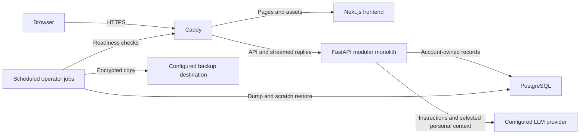

# Fareeq Personal AI Team — third-party project report

**Agent-name update — 2026-09-15:** Leo is the team leader; Nova (Study), Harvey (Career), Clara (Research), Alex (Writing), Tessa (Travel), Nate (Shopping), Emma (Finance), Maddie (Fitness), and Nora (Email) are the specialists. Fareeq is the product name. See [current naming and compatibility](AGENT-NAMES.md). Historical screenshots, decks and quality artifacts retain the names used when recorded; the earlier live evaluations predate the renamed prompts.

**Latest closeout — 2026-09-15 (checks run September 14):** the isolated production rehearsal
now passes 23 HTTPS browser checks, 25 automated accessibility scans and 351
backend tests in the locked production image, with recovery races exercised on
PostgreSQL. Schema `0004` migrations and full-table encrypted restore comparison
pass. Local alert simulation passes; public hosting, genuine remote storage,
real alert receipt and physical-device checks remain open. Six specialist prompts
and the quality judge were revised. The complete live run has 27 automated passes,
11 failures and one unavailable grade; all 13 live application journey checks
passed. [Latest quality evidence](quality-evidence-2026-09-15.md). Answer-quality
acceptance remains gated.
Read [the current rehearsal report](launch-rehearsal-2026-09-14.md) before the
historical September 13 measurements below. No frontend design changed.

**2026-09-14 follow-up:** the four findings in the subsequent application review
are fixed: stale fetches, explicit-null validation, new-conversation errors and
privacy wording. The latest full backend suite passes **351 tests**; frontend
build/typecheck and targeted browser regressions pass. See the
[review's remediation appendix](production-readiness-review-2026-09-14.md).
The September 13 measurements below remain historical. Later quality and
deployment verification is tracked in the current rehearsal report above.

**As of:** 2026-09-13, including the subsequent remediation working tree based on `1ed17eb`. The [independent review](production-readiness-review-2026-09-13.md) preserves the original findings and adds remediation status. **Package version:** frontend `0.1.0`. **Release decision:** local development usable; invite-only beta and public production remain gated. There is no verified public deployment in the evidence reviewed.

This document explains the current product and implementation to an engineer taking over without the original conversation. Statements marked **verified now** come from this review's checks. **Recorded evidence** comes from existing artifacts or dated implementation notes. **Proposed** work is not implemented. Repository links are relative so the document remains usable after transfer.

## 1. Product, audience and boundaries

Fareeq is a personal assistant and nine specialist AI conversations sharing selected facts about one person. Intended use cases include study planning, career preparation, research reasoning, writing/editing, travel planning, purchasing advice, budgeting, fitness planning, and email drafting. These are supported workflows, not evidence of a validated market or paying customer base. [Product description](product.md), [agent registry](../backend/app/agents/registry.py).

The product's distinction is a persistent personal context layer and visibly different human characters, rather than ten unrelated chatbots. Leo is the team leader/general assistant. Each specialist has its own configuration, prompt, domain framework, private notes and conversations. All run in the same backend runtime.

**Capability boundary:** the agents have no browsing, email sending, calendar access, purchasing, booking, external file access or real-world execution tools. Research reasons about supplied information; Shopping cannot verify current prices; Email drafts text rather than sending it. Shared guardrails explicitly prohibit claiming those actions. Do not market integrations that do not exist. [Context and guardrails](../backend/app/agents/context.py).

There is no native mobile application, payment/subscription system, push-notification service, or documented general-purpose background agent scheduler. Open signup is now implemented but disabled by default. The owner can operate an invitation-key beta or enable password signup; choosing a flag does not satisfy the release gates.

## 2. User journeys and screens

### Access and onboarding

The public entry screens are Login, Signup, Recover and Privacy. `/api/auth/status` tells the client whether authentication is required and signup is enabled. An operator can provision invitation-key accounts; password signup collects email, display name and a password, creates a session, and shows ten recovery codes. The signup UI asks the person to acknowledge saving the codes. Recovery uses a code and a new password; there is no email reset service or email-ownership verification. Recovery now locks the account, conditionally consumes an unused code, and changes credentials/session epoch in one transaction. Concurrent requests are regression-tested on SQLite and disposable PostgreSQL 16; real-host validation remains a deployment gate. [Auth routes](../backend/app/api/routes/auth.py), [signup screen](../frontend/src/app/signup/page.tsx).

Home contains the large Leo artwork, “Meet Leo,” the working “Message Leo” composer, featured specialist panels and Today. Submitting the hero passes the draft into Leo's chat route. Onboarding is conversational: the runtime marks the account onboarded after at least three shared facts, or four usable assistant turns plus at least one fact. With automatic memory disabled, that rule may require explicitly saved facts; it is not a separate universal onboarding-completion workflow. [Home](../frontend/src/app/page.tsx), [hero](../frontend/src/components/home/ModeerHero.tsx), [runtime](../backend/app/agents/runtime.py).

### Team selection and chat

Team features Leo and the nine specialists. Choosing one opens its workspace with identity artwork, a role-specific starter prompt and composer. Conversations are stored per agent and account. History is a drawer; the user can create a new conversation or delete an old one. On mobile the navigation and drawer adapt to the narrower viewport. [Team](../frontend/src/app/team/page.tsx), [workspace](../frontend/src/components/chat/ChatWorkspace.tsx), [shell](../frontend/src/components/AppShell.tsx).

Replies stream incrementally. A finished response is stored before memory extraction runs. The interface can then show newly saved facts and onboarding completion. “Context used” indicates that personal context was included, not a semantic proof that the model used it correctly. Markdown is rendered as React elements rather than raw HTML. [Stream hook](../frontend/src/features/chat/useChatStream.ts), [Markdown](../frontend/src/lib/markdown.tsx).

The persisted reply states are `completed`, `truncated`, `interrupted`, and `failed`. Truncated replies retain their text and offer **Continue**, which sends a new user message asking the agent to continue. It is another charged turn, not a transport resume. **Try again** regenerates the latest unfinished turn using its existing user message and removes the old unfinished reply. It is user-triggered, not automatic. Network interruption preserves partial text on a best-effort basis; a reload fetches the server record. A post-answer memory-update error now appears through the workspace error notice and accessibility announcement while retaining the completed reply. It does not automatically resend the message or claim memory was saved. [Message rendering](../frontend/src/components/chat/MessageBubble.tsx), [workspace](../frontend/src/components/chat/ChatWorkspace.tsx), [conversation service](../backend/app/conversations/service.py).

### Memory, goals and daily priorities

Memory separates facts shared with the team from notes private to a specialist. Users can save, correct and delete facts; shared facts can be pinned. User-authored facts and content corrections are protected against later automatic overwrites. Pinning alone does not claim authorship. A sensitive flag is classification metadata, not an access-control boundary: an explicitly saved sensitive fact can still be sent to agents whose category filters include it. [Memory UI](../frontend/src/components/memory/MemoryManager.tsx), [service](../backend/app/memory/service.py).

Goals support title, detail, priority 1–5, state `active`/`done`/`paused` and optional target date in the API. The UI exposes goal management and completion. The Today briefing is generated from stored goals and shared context using deterministic routing rules. It does not fetch a calendar, inbox or weather. Its date comes from the server, not a stored per-user timezone. [Goals](../backend/app/goals/schemas.py), [briefings](../backend/app/briefings/service.py).

### Account and recovery controls

Account supports profile preferences, an automatic-memory switch, password changes, recovery-code management, export, logout, sign-out-everywhere and account deletion. Automatic memory is **on by default**, including for migrated accounts; turning it off prevents new extraction calls but does not delete existing facts or stop existing context from reaching the reply model. Export is a JSON attachment with `Cache-Control: no-store`. Deletion requires the exact confirmation `DELETE` and clears the session. [Account page](../frontend/src/app/account/page.tsx), [user routes](../backend/app/api/routes/users.py).

## 3. Visual system and asset provenance

The approved direction is “Sunshine & Ink”: warm paper, bright yellow, pink accents, ink outlines, hard offset shadows, sparse handwritten annotations, and detailed editorial comic portraits of ordinary adult humans. The main portrait remains large and the hero composer remains interactive. It is not a superhero costume theme. [Design implementation](../frontend/src/app/globals.css), [home design notes](SUNSHINE-HOME.md), [interior notes](INTERIOR-PASS.md).

Core tokens: paper `#FFF7DF`, reading paper `#FFFCF2`, recessed paper `#FDF0CD`, sun `#FFDA45`, pink `#FF438A`, ink `#151714`, navy `#202D3B`. The contrast remediation uses ink text on pink fills and deep pink `#CC1757` for text. Standard borders are 2px; shadow tokens use hard offsets rather than blur. Grain and decorative art should not reduce reading clarity.

Fonts are Inter for interface text, Archivo Black for display, Permanent Marker for the wordmark, and Caveat for occasional annotations. They are loaded through `next/font/google` and served as build assets; obtaining them can require network access during a clean build. The layout uses English/Latin configuration. Arabic/RTL and broad localization have not been established. [Root layout](../frontend/src/app/layout.tsx).

All ten character entries use raster art; SVG definitions remain fallbacks. Assets are under [public/art](../frontend/public/art), with selection in [characters.ts](../frontend/src/lib/characters.ts). [CHARACTER-ART.md](CHARACTER-ART.md) records generation on September 10, a Career style reference, exact prompts for Travel/Shopping/Finance/Fitness/Email, and WebP processing. This is documented provenance for those assets, not a complete legal ownership/licensing inventory for every image and font. Before transfer or store publication, assemble the full asset manifest, applicable generation terms and font licenses. Do not infer exclusivity or rights clearance from possession of the files.

Recorded accessibility evidence: [accessibility-results.json](accessibility-results.json) contains 25 axe scan entries with no violations and keyboard checks across eleven routes. Desktop and 390px layouts were tested in desktop Chrome. This does not establish physical-device usability or screen-reader conformance. The interrupted NVDA experiment is documented in [launch-fixes.md](launch-fixes.md); no completed screen-reader sign-off exists. The September 14 production rehearsal independently reran 25 scans with zero findings; see [current accessibility evidence](accessibility-rehearsal-2026-09-14.json).

## 4. Architecture and request flow

This is a **modular monolith**: one FastAPI application contains domain modules for users, conversations, memory, goals, briefings, agents and operations. The frontend is Next.js/React/TypeScript. PostgreSQL is the production database; SQLite is the local-development/test path. SQLAlchemy owns persistence, Alembic owns schema evolution. [Backend entry point](../backend/app/main.py), [frontend package](../frontend/package.json), [deployment](../deploy/compose.yml).



The diagram shows the configured topology, not proof that a host or remote backup destination exists. Caddy exposes ports 80/443; production database/backend/frontend services have no published host ports. `/api/*` forwards to FastAPI with immediate streaming flush; other paths go to Next. Persistent volumes hold PostgreSQL data and Caddy certificate/config state. [Caddyfile](../deploy/Caddyfile).

For a chat turn: authenticate and charge the request window; resolve account/epoch and conversation ownership before opening the response; serialize the conversation within the backend process; persist the user message; load filtered memory, goals and history; build a context packet; charge estimated provider budget units; stream; save the final or partial assistant record; then optionally extract/store memories and emit a memory result. Browser and backend lifecycles are separate: receiving the answer's `end` event does not mean memory processing has finished.

There is no durable job queue or stream-event replay log. Conversation locks and operational counters are process-local. Database-backed usage counters and the new credential mutation lock operate through database transactions, but that does not make the entire application multi-worker safe. Keep one backend worker until turn claims and operational aggregation have explicit distributed designs.

## 5. Agent architecture and effective settings

Agent definitions live in `backend/app/agents/<slug>/config.py`, alongside `prompt.md` and `evals.json`. The code registry is authoritative; an `agents` database table mirrors it for persistence relationships. Startup synchronizes the registry. Agent behavior is configuration, not separately deployed services. [Registry](../backend/app/agents/registry.py), [schema](../backend/app/agents/schema.py), [sync](../backend/app/agents/sync.py).

The release environment example selects Groq `openai/gpt-oss-120b` and reasoning effort `low`. Writing explicitly overrides the model. These are source/example settings, not a declaration of private deployed environment values.

| Agent | Role | Temperature | Output cap | Prompt version |
|---|---|---:|---:|---:|
| Leo | General assistant and priorities | 0.55 | 650 | 4 |
| Study | Learning coach | 0.5 | 800 | 4 |
| Career | Careers, CVs, interviews | 0.55 | 650 | 5 |
| Research | Analysis and investigation | 0.4 | 800 | 5 |
| Writing | Drafting/editing; `qwen/qwen3.8-27b` | 0.3 | 1600 | 4 |
| Travel | Itineraries and constraints | 0.6 | 800 | 7 |
| Shopping | Choices and trade-offs | 0.5 | 1100 | 4 |
| Finance | Budgeting and financial planning discussion | 0.4 | 800 | 4 |
| Fitness | Training plans | 0.5 | 800 | 5 |
| Email | Email drafting | 0.6 | 1000 | 3 |

Caps above are agent settings; the Groq GPT-OSS adapter adds 512 completion tokens for reasoning. Generic `LLM_MAX_TOKENS`/`LLM_TEMPERATURE` settings must not be mistaken for an override of every agent's configured values. One provider is selected per application; changing it requires checking that all explicit model overrides exist on that provider. [Provider factory](../backend/app/llm/provider.py), [OpenAI-compatible adapter](../backend/app/llm/openai_compat_provider.py).

Context combines prompt/framework/behavior/safety instructions, name/profile, relevant shared categories, this specialist's private namespace, up to five active goals, and up to 20 history turns (40 messages). Shared preferences are broadly relevant; other categories are filtered by agent configuration. Failed placeholders are omitted from model history. Each profile, goals and memory block body is capped at 6000 characters, including oversized legacy values; these are per-block limits, not a total prompt/token guarantee. New memory values and goal details are limited to 2000 characters. Profile validation applies after merging updates: at most 20 fields, 40-character keys and 300-character values. A rejected update leaves stored data unchanged; prompt clipping also leaves legacy records intact. There is no embedding retrieval or vector database. [Context builder](../backend/app/agents/context.py), [profile service](../backend/app/users/service.py), [goal schemas](../backend/app/goals/schemas.py).

The recent grounding rules prevent inventing dates, currencies, product/equipment details, and unprovided biographical achievements, and favor a useful first draft over question-only responses. They are instructions and evaluation checks, not deterministic guarantees of truthful output.

**Ask My Team:** `TEAM_ENABLED=false` by default, with no frontend caller. If enabled, it runs up to five selected agents sequentially, each in a new conversation with shared context only and no extraction, then synthesizes with Leo. It can therefore require up to six generation calls. It does not expose specialist private notes to synthesis. It is not the normal routing path, an autonomous delegation engine, or a background collaboration service. [Team route](../backend/app/api/routes/team.py).

## 6. Data model and lifecycle

Verified ORM metadata has **ten application tables**, plus Alembic's separate version table. Some older documentation counts that incorrectly. [Models](../backend/app/db/models.py).

| Table | Purpose and ownership |
|---|---|
| `users` | Account, optional email/password hash, display name, profile JSON, onboarding flag, session epoch, automatic-memory preference |
| `recovery_codes` | Account-owned code hashes and used timestamp; raw codes are returned when issued |
| `agents` | Global code-registry mirror |
| `conversations` | User/agent-owned thread with title and latest-message time |
| `messages` | Conversation-owned text, role, timestamps and diagnostics/completion metadata |
| `shared_memories` | User-owned category/key/value facts, unique per user/key, including source/confidence/sensitive/pinned fields |
| `agent_memories` | User/specialist namespace facts, unique per user/agent/key |
| `goals` | User-owned priorities, status, details and optional date |
| `briefings` | User-owned persisted daily summaries/items |
| `usage_buckets` | Atomic fixed-window counters; also contains hashed auth-attempt subjects |

Migrations: `0001` initial eight application tables; `0002` usage buckets; `0003` session epoch; `0004` password hash, automatic-memory preference and recovery codes. Current schema is therefore ten application tables, not eleven. [Migration directory](../backend/migrations/versions).

Automatic memory is extracted from the user's message, not invented from the assistant's reply. The real-provider path requests structured candidates; parsing/provider failures fall back to rules. Candidate types, domain/scope, key format, confidence, length and sensitivity are checked. Unknown specialist scopes are rejected rather than widened. Missing or malformed sensitivity flags are conservative; an explicit false flag still passes through a keyword/category backstop that can miss sensitive wording. Both this limitation and provider data sharing must remain accurately disclosed. [Extraction](../backend/app/memory/llm_extraction.py), [backstop](../backend/app/memory/sensitivity.py), [privacy notice](../backend/app/legal/privacy.md).

Explicit saves bypass automatic inference and record source `user`. Content edits also acquire that source; automatic updates preserve them. Automatic memory opt-out affects future learning, not already saved context. There is no per-fact consent approval queue. Existing sensitive data is not automatically purged; use the [memory audit tool](../backend/tools/memory_audit.py) and the documented remediation procedure with an authorized operator.

Account deletion cascades through account-owned records and removes account usage counters. Export contains account data, conversations/messages, memories, goals and briefings, not password/recovery secrets. Database deletion does not immediately erase historical backups or copies already transmitted to the provider. Apply backup retention and prevent a disaster restore from silently resurrecting previously deleted accounts; that operational procedure needs owner responsibility. Storage encryption for live database volumes and provider retention are deployment/provider choices, not guarantees established by application code. [User service](../backend/app/users/service.py).

## 7. API and security contracts

All paths below are under `/api`. Exact request/response schemas live beside each domain and in [frontend types](../frontend/src/types/index.ts). Production hides interactive API documentation; inspect the schema in a safe development environment.

| Surface | Methods and behavior |
|---|---|
| `/auth/status`, `/auth/login`, `/auth/signup`, `/auth/recover`, `/auth/logout` | GET status; POST credential/session actions; signup feature-gated |
| `/auth/account`, `/auth/password`, `/auth/recovery-codes`, `/auth/sign-out-everywhere` | GET account security summary; POST authenticated credential/revocation actions |
| `/users/me`, `/users/me/export`, `/users/me/delete` | GET/PATCH profile; GET JSON export; POST deletion with `confirm: DELETE` |
| `/agents`, `/agents/{id}` | GET public identity/configuration subset, excluding private framework/model settings |
| `/agents/{id}/chat/stream` | POST JSON message/conversation/retry request; SSE response |
| `/agents/{id}/chat` | Nonstreaming convenience POST, disabled in production |
| `/conversations`, `/conversations/{id}` | GET list/detail, POST creation, DELETE thread; ownership checked |
| `/memory/shared`, `/memory/shared/{id}` | GET/POST collection, PATCH/DELETE item |
| `/memory/agent/{agent_id}`, `/memory/agent`, `/memory/agent/{id}` | GET specialist notes, POST creation, PATCH/DELETE item |
| `/goals`, `/goals/{id}` | GET/POST collection, PATCH/DELETE item |
| `/briefings/today` | GET persisted/current daily briefing; optional refresh |
| `/team/ask` | Feature-gated authenticated POST consult |
| `/health`, `/health/detail`, `/legal/privacy` | GET public health subset/readiness/privacy; admin gets expanded readiness |
| `/admin/dashboard`, `/admin/metrics`, `/admin/test-alert` | Admin-only HTML/JSON and POST test alert |

Authentication uses a signed `modeer_session` cookie scoped to `/api`, HttpOnly, SameSite Strict, Secure in production, default lifetime seven days. HMAC binds account ID, epoch, expiry and any configured invitation-key digest. Account epoch checks revoke sessions; rotating an invitation key invalidates bound sessions. Passwords use salted scrypt; recovery codes use hashes. Neither is stored as plaintext. Password bounds are 10–128 characters. There is no per-device refresh-token/session table. [Auth primitives](../backend/app/core/auth.py), [passwords](../backend/app/core/passwords.py).

Browser mutations enforce the configured Origin. Production ignores arbitrary user identity headers; development intentionally supports `X-User-Id` and must not be exposed publicly. Account/admin dependencies gate data access. Public signup throttles to five creations per address/hour; password/recovery attempts share ten per email/15-minute window. This does not prove resilience to distributed signup, random-email load, or denial of login by exhausting a known person's allowance. Client-address trust assumes the configured proxy topology. Keep the backend private and reassess forwarded headers before adding a CDN.

Chat defaults are six requests per account/minute and 60,000 conservative budget units per UTC day. Budget units are UTF-8 input bytes plus output allowance/framing, not metered provider tokens or billable dollars. Extraction also uses the provider budget. Provider failure before any emitted text refunds that provider-call budget; partial replies/cancellations remain charged, and request-attempt limits remain separate. All accounts still share the upstream provider's quota. [Usage implementation](../backend/app/core/usage.py), [policy](usage-limits.md).

SSE uses JSON `data:` frames separated by blank lines: `start`, `delta`, `end`, `memory`, `error`. HTTP errors before the stream can be 401/403/404/422/429; after headers, failures travel as events and persisted completion metadata. There are no replay sequence IDs, Last-Event-ID recovery, or idempotency keys. Consumers must distinguish answer completion from memory completion and fetch authoritative history after uncertain delivery.

Security headers include a per-request script nonce/strict-dynamic CSP on pages, a Caddy fallback policy, frame denial, nosniff, HSTS, same-origin referrer policy, COOP and Permissions-Policy. Styles retain inline permission. Markdown links use an explicit URL policy. No model text is deliberately rendered as raw HTML. These are implemented controls, not evidence that every injection or abuse path is eliminated. [Proxy policy](../frontend/src/proxy.ts), [link policy](../frontend/src/lib/links.ts).

## 8. Reliability, operations and deployment

The OpenAI-compatible adapter caps a whole reply at the configured 35 seconds by default and separately watches idle streaming gaps; memory has an 8-second limit. The frontend aborts the whole chat request at 50 seconds. Changing backend limits without coordinating the frontend can cause client-side cancellation. Provider throttles carry retry guidance; ordinary chat does not silently retry. Interrupted-save behavior is best effort and cannot protect against abrupt process/host death.

Readiness checks the database and compares installed Alembic revisions to packaged migration heads. Sustained provider failures, blocked quota and recent unhandled errors can degrade status. Basic health includes database access and is not a pure process-only liveness probe. Admin metrics/HTML show usage and runtime counters. Empty `ADMIN_ACCOUNTS` allows nobody. Counters and failure streaks reset with the process. [Health](../backend/app/api/routes/health.py), [observability](../backend/app/core/observability.py), [admin](../backend/app/api/routes/admin.py).

Webhook/Telegram alerts and the external watchdog are implemented. The watchdog can detect host loss only when run elsewhere. A webhook returning success is not proof a person received the alert. Scheduled jobs must be installed by the operator; the application does not install cron jobs itself. [Operations runbook](OPERATIONS.md), [watchdog](../deploy/watchdog.sh).

Linux backups use `pg_dump`, OpenSSL AES-256-CBC/PBKDF2 encryption, copied-byte verification, exclusive locking, transient plaintext cleanup and configurable retention (30 days default) on both directories. Restore creates a scratch database and verifies rows, then cleans up. The script requires a distinct writable backup destination; it cannot prove that directory is physically off-host. Encryption/copy comparison is not an authenticated archival format or a guarantee against malicious remote replacement. Restrict storage access and consider authenticated backup tooling as hardening. [Backup](../deploy/backup.sh), [restore](../deploy/restore-check.sh), [nightly wrapper](../deploy/nightly-backup.sh).

Recorded Linux operations evidence covers eight checks using disposable containers and a second directory on the same machine. The last documented backup schema round-trip predates `0004`; rerun it with recovery-code data. Restore verification is currently a smoke check, not an exhaustive comparison of every table and deletion policy. Proposed service objectives, RPO/RTO and storage capacity must be chosen and measured; none is established by the repository.

### Configuration reference

No real values or credentials are reproduced here. [Settings source](../backend/app/core/config.py), [deployment example](../deploy/.env.example).

| Variables | Meaning / default or requirement |
|---|---|
| `APP_NAME`, `ENVIRONMENT`, `DEBUG` | Product label; production requires debug off |
| `AUTH_REQUIRED`, `AUTH_SECRET`, `AUTH_ACCESS_KEYS`, `SESSION_SECONDS` | Production auth on; signing secret at least 32 characters; optional UUID→key-digest map; 604800-second default |
| `SIGNUP_ENABLED`, `TEAM_ENABLED` | Both false by default; independent feature decisions |
| `DATABASE_URL` | Local SQLite default; Compose supplies PostgreSQL connection |
| `DOMAIN`, `DB_PASSWORD` | Compose host/domain and URL-safe database credential; keep secrets outside Git |
| `FRONTEND_URL` | Browser Origin/CORS and production HTTPS requirement; deployment expects one origin |
| `NEXT_PUBLIC_API_URL`, `BACKEND_URL` | Browser API base defaults to `/api`; Next's server rewrite defaults to `http://localhost:8000`. Public-prefixed values are not secrets. Production Caddy routes `/api` directly to the backend. |
| `LLM_PROVIDER`, `LLM_API_KEY`, `LLM_MODEL`, `LLM_BASE_URL` | Provider, secret, fallback model and optional compatible endpoint; production refuses mock/missing key |
| `LLM_REASONING_EFFORT`, `LLM_TIMEOUT_SECONDS` | `low`, 35 seconds by default; coordinate with client timeout |
| `LLM_MAX_TOKENS`, `LLM_TEMPERATURE` | Generic settings exist; inspect per-agent ModelConfig for actual chat caps/temperature |
| `MEMORY_EXTRACTION`, `MEMORY_TIMEOUT_SECONDS` | `auto`/`llm`/`rules`; default 8 seconds |
| `MEMORY_STORE_SENSITIVE`, `MEMORY_MIN_CONFIDENCE` | Default false and 0.55; best-effort classification, not a universal privacy guarantee |
| `ACCOUNT_REQUESTS_PER_MINUTE`, `ACCOUNT_DAILY_TOKEN_BUDGET` | 6 and 60000 default; fixed UTC windows |
| `ADMIN_ACCOUNTS` | Operator account IDs; empty denies all |
| `ALERT_WEBHOOK_URL`, `ALERT_TELEGRAM_BOT_TOKEN`, `ALERT_TELEGRAM_CHAT_ID`, `ALERT_ERROR_THRESHOLD` | Optional delivery channels; error threshold defaults to 3 |
| `MODEER_COMPOSE_FILE`, `MODEER_BACKUP_DIR`, `MODEER_BACKUP_OFFHOST`, `MODEER_BACKUP_KEEP_DAYS`, `MODEER_BACKUP_PASSPHRASE_FILE` | Operator backup configuration; destination/key required by Linux procedure |
| `MODEER_URL`, `MODEER_WATCHDOG_STATE`, `MODEER_WATCHDOG_TIMEOUT` | Watchdog target, state path and request timeout |

The per-user `memory_auto` setting is database state, not an environment variable. Frontend API base/proxy behavior is defined in [api.ts](../frontend/src/lib/api.ts) and [Next configuration](../frontend/next.config.mjs); maintain same-origin `/api` for the browser deployment.

### Setup and reproducible release procedure

For local development, use Python 3.12 and Node 22 as aligned with the Dockerfiles. In `backend`, create a venv and install `requirements-dev.txt`; set a local SQLite URL and mock provider for non-billable development; run `python -m uvicorn app.main:app --host 127.0.0.1 --port 8000`. SQLite startup creates tables. In `frontend`, run `npm ci`, then `npm run dev`. Do not reuse a production database for tests. [README](../README.md), [deployment runbook](DEPLOYMENT.md).

For production, make a private `deploy/.env` from the example, select the domain/provider/account mode, provision secrets and the operator, and use the Compose runbook. The backend image installs `requirements.lock` with hashes and no dependency resolution, then runs Alembic upgrade before one Uvicorn worker. Frontend installs with `npm ci`; Python/Node/Postgres/Caddy production bases are digest-pinned. Windows development dependencies and the Linux lock differ where platform packages require it.

Release order: freeze revision/settings → test/audit → back up and verify restoration → build immutable release images → rehearse migration → deploy within an authorized window → verify schema/readiness, real-domain session isolation and streaming → verify alerts and scheduled backups → record release evidence. Add automated CI for this sequence; no `.github` workflow directory was present during review.

Rollback must name retained previous images and a tested database strategy. Rebuilding floating application tags later is not an immutable rollback. Do not blindly downgrade schema `0004`: it removes new account fields/code storage. If schema rollback loses accepted writes, use an explicit maintenance/restore plan or forward fix. Test on a restored copy and record recovery time before launch. Never use the rehearsal's `down -v` cleanup against production volumes.

## 9. Completed work and evidence history

| Revision / artifact | Subsystem and outcome |
|---|---|
| `c25caec` (historical redesign record) | Comic design system and screen restyling; early provisional character illustrations |
| [CHARACTER-ART.md](CHARACTER-ART.md), September 10 | Remaining character raster artwork and processing provenance |
| `30ae80d` | Operator dashboard and alert delivery channels |
| `c76bd9d` | Account controls, memory preferences and launch operations; quality gaps recorded |
| `d3e2494` | Reply length settings/prompts; subsequent hardening corrected completion handling |
| `172f857` | Approved Home/app-shell/hero restoration |
| `ee5328d` | Private-memory validation, explicit reply states, locked dependencies and review remediations; consult detailed review appendices for individual tests |
| `f0e5aa4` | Password signup/recovery codes, per-user automatic memory, nonce CSP, public-surface restrictions and owner decisions |
| `682f6cf` | Grounding rules for currencies, prices and owned equipment; prompt-version changes |
| `80cf49a` | Contrast fix: ink on pink, deeper pink text |
| `1ed17eb` | Currency-code check restricted to codes beside figures, fixing Research acronym false positives |
| September 13 remediation working tree | Atomic credential mutations and recovery-code use; visible memory errors; merged profile and legacy context bounds; content-hashed, per-row quality provenance and reconciled evidence. See section 10 for measured results and remaining gates. |

Historical commit descriptions establish development intent; current source and fresh checks determine current behavior. Detailed sequence and recorded image/browser checks are in [launch-fixes.md](launch-fixes.md) and the [September 11 review appendices](production-readiness-review-2026-09-11.md). This report does not silently replace those historical records.

## 10. Verification, defects and release gates

**Historical September 13 remediation:** 326 backend tests passed (including seven new recovery, profile/context and provenance cases); frontend production build/type checking passed; frontend lint 0 errors/13 warnings; the scripted stream-hook check preserved a completed answer and delivered the distinct memory failure; link checks passed. Ruff passed. The earlier review ran 319 tests and an npm production advisory audit reporting zero; that audit was not repeated in remediation. The backend suite emits one Starlette TestClient deprecation warning. Docker was unavailable, so fresh production image, PostgreSQL, browser and backup tests were not possible in this session. Python audit is historical, not rerun.

Recorded [production rehearsal](production-rehearsal-results.json): 23 checks, no CSP violations/page errors, scripted upstream, localhost TLS. Recorded [accessibility results](accessibility-results.json): 25 scan entries with no violations plus keyboard checks. Those files do not carry an immutable source/build fingerprint. Recorded [Linux operations results](linux-operations-results.json) explicitly say the copied storage is not physically off-host. Local scripts exercising real components do not establish a public deployment.

Quality history: September 12 single-sample files each record 12/13; the older September 13 partial records 32/36 out of 39 planned; the subsequent [partial](quality-release-2026-09-13b.json.partial) has only 6/39 and records 5/6, with one stale Research false-positive grade. Regrading those six against the corrected deterministic rubric passes all six; it does not test the remaining 33 responses. The original independent review made no generation/judge calls. The subsequent remediation does run a fresh three-sample suite; see [quality evidence](quality-evidence-2026-09-13.md) for its exact results, source hash, effective configuration and limitations. Historical files were not rewritten. Writing shares its model with the judge, limiting independence. [Evaluation runner](../backend/quality_check.py), [rubric](../backend/app/agents/rubric.py), [agent evaluation cases](../backend/app/agents/evals.py).

Reproduce local checks from their respective directories:

```text
backend:  .venv/Scripts/python.exe -m pytest -q
backend:  .venv/Scripts/python.exe -m ruff check .
frontend: npm ci
frontend: npm run typecheck
frontend: npm run lint
frontend: npm run build
frontend: npm audit --omit=dev
frontend: node tools/stream-check.cjs
frontend: node tools/links-check.cjs
```

When authorized quota is available, from `backend`, run `python quality_check.py --samples 3 --judge-model qwen/qwen3.8-27b --out ../docs/quality-RELEASE-ID.json` using the intended environment. Freeze the code/config first. Do not pass `--model` unless intentionally overriding every agent for an experiment; that would erase Writing's normal distinction. Inspect `python journey_check.py --help` and run the real-runtime journey separately. Follow [rehearsal README](../deploy/tests/production-rehearsal/README.md) for isolated browser/image checks and [DEPLOYMENT.md](DEPLOYMENT.md) for Linux lock/audit commands. Synthetic model-quality tests are not a substitute for the browser journey.

The [September 13 review](production-readiness-review-2026-09-13.md) records these original findings. Subsequent remediation status:

1. **Fixed locally:** recovery, password changes, recovery-code replacement and global sign-out serialize credential mutations; recovery also conditionally claims an unused code. Issued cookies use the committed epoch snapshot. SQLite and disposable PostgreSQL concurrency regressions pass; see the September 14 rehearsal.
2. **Fixed:** memory errors propagate through the stream hook into the visible workspace notice and accessibility announcement without discarding a completed answer. The hook has a scripted regression check and the September 14 targeted browser replay validates its failure notice.
3. **Fixed:** merged profile validation, goal write limits and prompt-time bounds protect against repeated updates and oversized legacy context. Stored legacy data is not silently deleted; its privacy audit remains an operational action.
4. **Remediated evidence handling:** source-content hashes, effective agent model settings and per-row provenance now accompany new quality results; incompatible resumes fail by default. Historical results remain intact. See [quality evidence](quality-evidence-2026-09-13.md) for measured outcomes and remaining limitations.

Other limitations: process-local turn locks; no general idempotency or resumable stream; no pagination for several potentially growing collections; best-effort sensitive detection; automatic memory default on; unverified email identity; shared upstream quota; incomplete screen-reader/device evidence; no installed automated CI pipeline established by this review. These should be prioritized by exposure and scale rather than all labeled proven security defects.

The historical September 13 measurement recorded **33/39 passes and six failures**. The completed September 14 run, using revised prompts and stricter criteria, records **27 automated passes, 11 failures and one unavailable grade** across 39 responses. No answer-provider errors or truncation occurred. Manual spot checks identify both judge mistakes and missed defects; the unavailable-grade retry also failed to parse. Do not compare the raw totals as if the rubric were unchanged. [Current results and adjudication](quality-evidence-2026-09-15.md).

Release gates still open: actual host/domain TLS and account isolation; remediation/adjudication of measured quality failures; broader concurrency/load checks beyond the two verified PostgreSQL recovery races; encrypted restore of schema `0004` from genuinely remote storage; installed scheduler/retention verification; receipt of alerts by a real operator; physical phone and completed screen-reader testing; authorized remediation of pre-hardening memory data. Public signup additionally needs abuse/capacity and account-support policy sign-off. There is no unrestricted public-launch approval in this report.

## 11. Third-party takeover and ordered next actions

1. Record the working-tree baseline and protect the owner's unfinished documentation/quality run. Read this report, the September 13 review, then the operational runbooks. Confirm which environment is safe to modify.
2. Read the passing same-code and distinct-code PostgreSQL recovery results; extend concurrency coverage to additional overlapping credential changes and deployment load where required.
3. Carry the passing memory-failure/browser regressions into hosted staging. Preserve approved artwork/layout; audit any other database containing legacy stored memory separately from prompt clipping.
4. Adjudicate the completed 39-response run and address the observed quality issues. Freeze any further changed prompts/configuration, rerun with new fingerprints and repeat the live journey after material changes. The September 14 live journey passed 13 checks. Preserve old partials and this complete run.
5. Use the verified production images/migration/browser baseline for hosted staging; complete physical-device and human assistive-technology testing on a dedicated machine.
6. Obtain owner decisions for domain/host, account mode, provider capacity, retention/recovery objectives, alert recipient, privacy/support ownership and the automatic-memory default. Do not invent credentials, budget or permissions.
7. Rehearse current-schema off-host restoration and incident handling, deploy only with authorization, and record real-domain evidence before inviting users.
8. Begin the mobile authentication/streaming feasibility milestone only after the critical backend issues are closed. Follow [MOBILE-ROADMAP.md](MOBILE-ROADMAP.md); no native implementation was started by this documentation pass.

The handover is complete when a new engineer can reproduce the checks, identify the running revision/configuration, restore a backup, revoke a compromised account, and distinguish measured quality from an unverified claim. The repository alone does not transfer provider accounts, domain ownership, signing credentials, secret recovery material, asset rights, or operator responsibility; those require an explicit owner handover.
